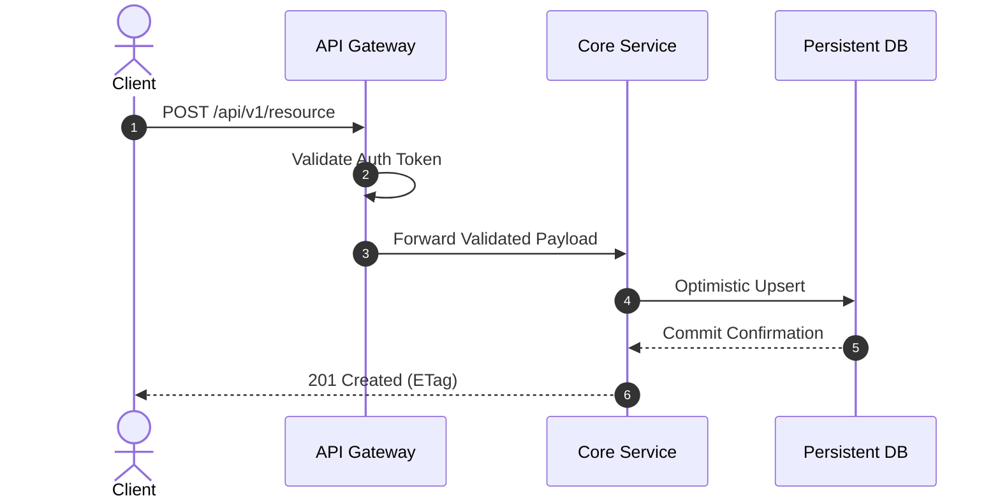

# RFC: [Proposed Architecture / Feature Name]

**RFC Number:** RFC-XXXX  
**Status:** DRAFT / IN REVIEW / APPROVED / REJECTED / SUPERSEDED  
**Author:** @author  
**Sponsor:** @staff-architect  
**Created Date:** YYYY-MM-DD  
**Target Decision Date:** YYYY-MM-DD  

---

## 1. Problem Statement & Motivation
What customer or engineering problem does this RFC address? Why is the current architecture insufficient? Include relevant latency numbers, error rates, maintenance costs, or product bottlenecks.

## 2. Goals & Non-Goals
### In-Scope Goals
- Clearly enumerated deliverable 1.
- Clearly enumerated deliverable 2.

### Explicit Non-Goals
- Explicitly out-of-scope requirement A (deferred to future phase).
- Explicitly out-of-scope requirement B (deliberately avoided).

## 3. Proposed Architecture & System Design
Provide high-level architectural block diagrams, state machines, or sequence flows.

### Key Data Structures & Contracts
Detail schema interfaces, TypeScript types, or Protobuf definitions.

## 4. Alternatives Considered
| Architecture / Approach | Pros | Cons | Reason Rejected |
| :--- | :--- | :--- | :--- |
| **Alternative 1 (Status Quo)** | Zero migration cost | Unsustainable database load | Fails Q4 traffic projections |
| **Alternative 2 (Event-Driven)** | High throughput | Eventual consistency complexities | Unnecessary for current SLA |

## 5. Security, Privacy & Data Compliance
- How is authentication & authorization enforced across services?
- Does this introduce PII or sensitive data storage?
- Are data retention and GDPR/CCPA deletion flows accommodated?

## 6. Observability, Deployment & Migration Plan
- **Feature Flags**: What flag controls traffic rollout?
- **Canary Rollout**: 1% -> 10% -> 50% -> 100% monitoring plan.
- **Rollback Criteria**: What error rate or P99 latency threshold triggers automatic rollback?

## 7. Unresolved Questions & Discussion Points
- Open question 1 for reviewer feedback.
- Open question 2 regarding third-party vendor dependency.
